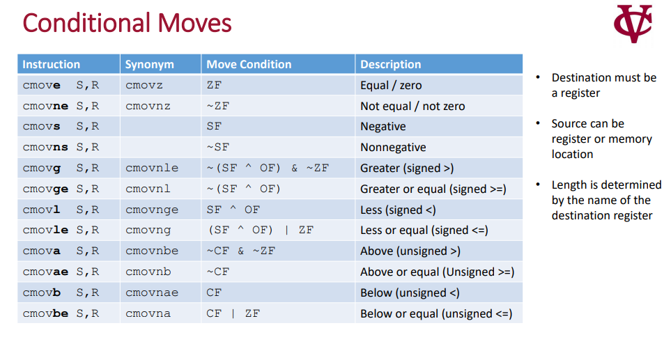
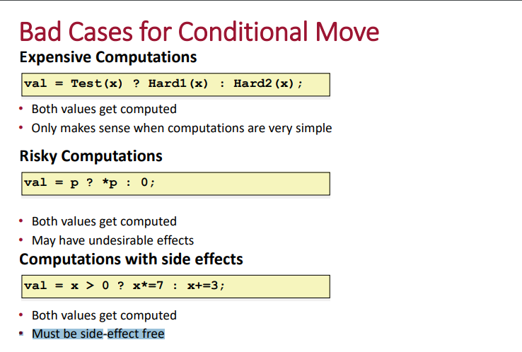
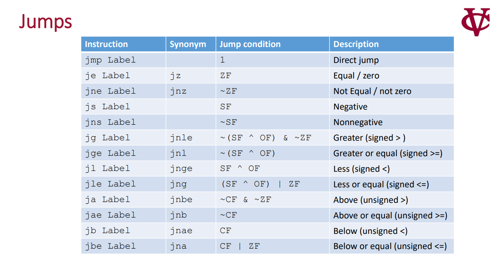
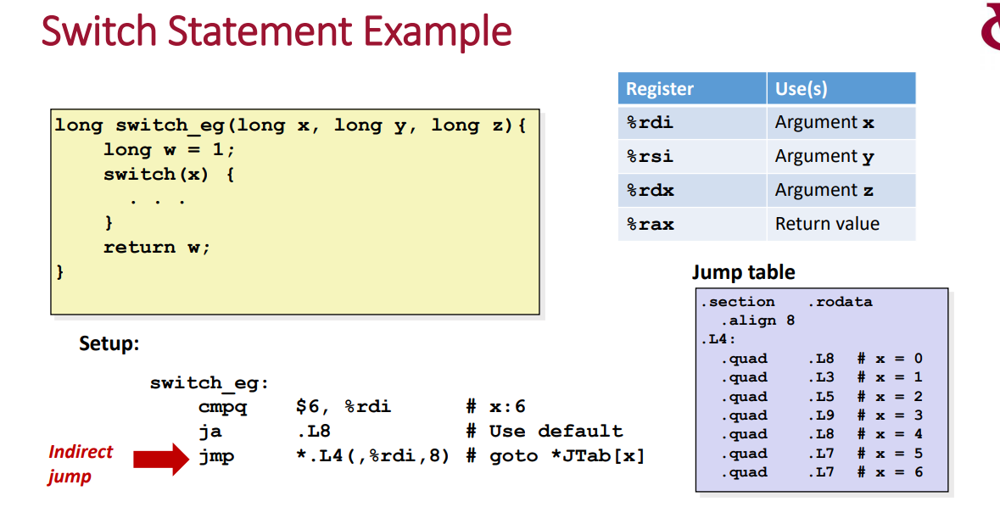
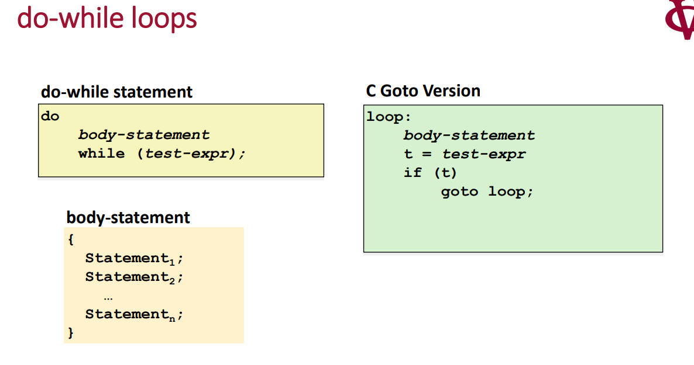
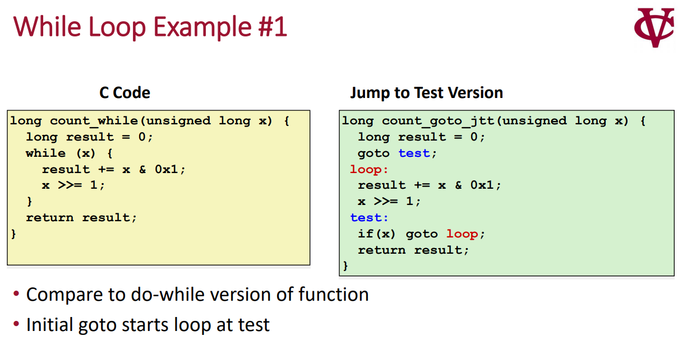
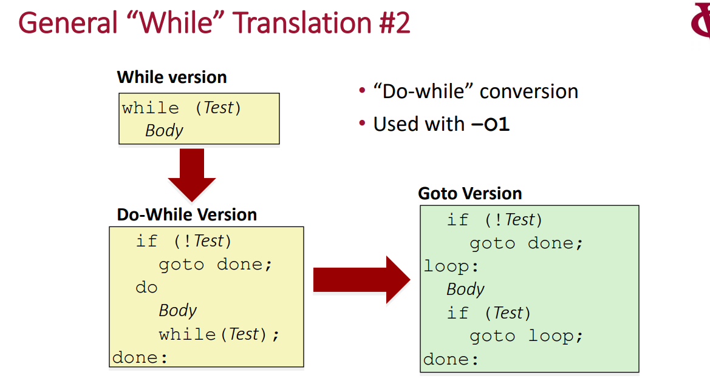
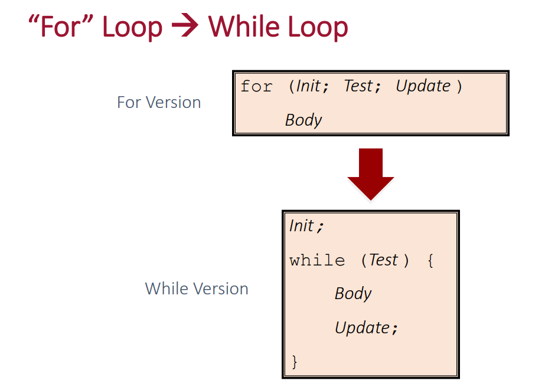

# X86指令集

课程参考:
 - https://cs224.cs.vassar.edu/
 - https://www.youtube.com/watch?v=teWC3tP4jwQ

我们将正式进入ISA设计、学习

 - CISC：复杂指令
 - RISC：简单指令集

本章节主要引用 X86体系 的指令集

## 基本语法格式
[视频链接](https://www.youtube.com/watch?v=teWC3tP4jwQ)

参考该视频 总结如下:
 - CPU其实主要打交道的对象就是内存,从计算指令到 计算本身的输入和输出，都依赖主存
 - 基本语法表示：Ins SOURCE DEST
 - 立即数：$123
 - 寄存器表示是内存地址: (%reg) 
 - 立即数内存地址： 123 

X86一共16个通用寄存器,R表示使用8byte，E表示4byte，没有前缀：2byte,  H/L(高8bit 低8bit)
 - (R/E)AX(l/h) (R/E)BX (R/E)CX (R/E)DX: rax eax ax, al,al
 - (R/E)SI(l): rsi, esi, si, sil
 - (R/E)DI(l): rdi, edi, di, dil
 - (R/E)SP(l): rsp, esp, sp, spl
 - (R/E)BP(l) ：rbp, ebp, bp, bpl
 - R8-16(D/W/B)： 8个通用寄存器, r8, r8d, r8w, r8b

指令后缀： b(byte) w(2 byte) l(4 byte) q(8 byte)

### LEA指令
第一个指令，load effective address 计算内存地址,并把结果保存到目标寄存器，主要用于计算数组、结构体内某个元素的内存地址
  公式是: A + B\*y + C 

让我们看一下为什么是这个公式，以及实际应用, 

已知某个基础类型(char short int long)数组，基址为0x100，计算任意一个数组下标元素的地址:0x100 + index mut (1,2,4,8) 

已知某个结构体基址X，以及某个元素的在结构体内偏移是Y,，求该元素的地址:  X + Y 

已知某个结构体数组基址X，结构体的大小为Y, 偏移Z，求任意一个数组下标内的元素地址: X + Y*index + D (这个公式实际上并不正确 继续往下看)  

知识点总结:

 - leaq 完成内存地址的计算
 - 单纯复制: 寄存器A保存的内存地址copy到寄存器B  leaq (%regA), %regB
 - 基本偏移: 寄存器A的内存地址经过指定偏移8 并存储到寄存器B leaq  8(%regA) regB
 - 数组访问: 寄存器A的内存地址，经过REGB的偏移， 并存储到寄存器C leaq (%regA，%regB) regC
 - 数组高级访问: 允许对下标左移1，2，4，8： leaq (%regA，%regB, （1,2,4,8） ) regC
 - 计算内存地址的通用格式 D(%regA, %regB, scale_factor) = (%regA+regB\*scale_factor + D)
 
注意: 由于 scale number 只能是1,2,4,8 让我们在回到之前说的 这个公式能否计算结构体数组元素的地址
已知某个结构体数组基址0x100，结构体的大小为20(0x14), 数组内元素偏移16，求第100个下标内的元素地址: 

可以表达为:  0x100 + 20 mut 100 + 16  由于scale_factor 只能是 1 2 4 8 所以没有办法应用
 
应该替换为: 0x100 + 8 mut 250 + 16，但是编译器会不会这么聪明呢？可以自己实验一下

经过实验，该指令更通常的用法是:
 - 栈变量索引: D作为一个常量表示栈上的变量偏移,regA栈指针
   regB是index，scale_factor表示基础类型大小偏移
 - 全局变量索引: D作为一个常量表示全局变量基址,regA不使用
   regB是index，scale_factor表示基础类型大小偏移
 - 总结就是，Lea索引基础类型是非常快的，但是索引结构体数组,编译器处理不好

计算不同地址，不同后缀指令 需要配合恰当寄存器使用
 - leab (%rax) al 
 - leaw (%rax) %ax
 - leal (%rax) %eax

注意： 该指令也可能被用来做数学计算，不一定就是计算地址

### MOV指令
movq source(立即数、寄存器、内存地址) dest(寄存器，内存地址) 

实现如下功能: 

 - 加载立即数到寄存器或内存地址:  movq $123  rax/ movq $123  (%rax)
 - 把寄存器内容 copy到寄存器或内存地址 : movq rax rbx /movq rax (%rbx)  
 - 从内存地址copy到寄存器:  movq (%rax), %rdx
 - 不支持内存到内存的数据转移
 
关于内存地址格式, 支持：
 
 - 内存地址立即数： 0X100
 - 寄存器地址访问: （%rax） 
 - 寄存器地址偏移:  D(%rax) = D + rax 
 - 寄存器index+偏移: D（%rax,%rbx） = D + rax + rbx
 - 寄存器index scale + 偏移: D（%rax,%rbx, [1,2,4,8]） = D + rax + rbx * [1,2,4,8]

关于内存地址，基本上和LEA类似，支持内存地址的计算


### 两个操作数的计算指令
mov 类似，还有其他一些两个操作数的计算指令 

 - ADD SRC, DEST: DEST = DEST+SRC
 - SUB SRC, DEST: DEST = DEST - SRC
 - imu SRC, DEST: DEST = DEST * SRC
 - SAR SRC, DEST: DEST = DEST >> SRC （算术右移）
 - shr SRC, DEST：DEST = DEST >> SRC 逻辑右移
 - shl SRC, DEST: DEST = DEST << SRC 左移：
 - xor SRC, DEST: DEST = DEST ^ SRC 
 - and：   DEST = DEST & SRC
 - OR： DEST = DEST | SRC 

### 一个操作数的指令

 - INC DEST : DEST = DEST+1
 - DEC DEST : DEST = DEST -1 
 - NEG DEST : DEST = -DEST
 - NOT DEST : DEST = ~DEST  


### 处理器状态描述

在之前，我们探讨了一些基本的指令 比如内存地址计算，内存和寄存器的值得移动，以及一些基本得计算指令，也简单介绍过了X86体系下得16个基本寄存器

 - r8-r15 
 - r(a,b,c,d)x
 - rsi rdi rsp rbp
 
上面得16个通用寄存器，主要是用来存储过程变量，也就是计算过程中 主要用于临时存储，还有一些特殊得寄存器 

 - RIP： 记录当前执行指令内存地址
 - EFLAGS： 记录最近一条指令得执行结果(不是计算结果)


EFLAGS(CS) 寄存器不能够被计算人员访问设置，他的设置由体系架构设置， 该寄存器通过利用不同BIT，表示上一条指令得执行结果，虽然如此，但是一般一条指令射击一个BIT

 - CF： 表示2进制计算时 是否发生了进位或者借位
 - OF： 是否发生了补码溢出 

我们这里需要辨析一下这两个标志位，一是容易混淆，而是为了复习并加深理解，让我们回忆之前得课程，CPU是二进制得逻辑电路计算，他并不尝试去对 数据解释，因此他没有十进制、也没有正负数得概念，但是作为程序员，也就是人类世界，又存在这种含义，怎么办呢？那就只能通过人编写得程序去理解，我们这里使用ADD 加法指令举例 

```c
	mov $150, %al
	add %al, %al
```

CF的意义：
已经知道一个al寄存器只有1byte，范围是 0-255, 很明显上面的计算超出了这个范围，因此当计算完成，CF 标志会被置位， 同理，减法也一样，当两个寄存器发生了减法运算，如果发生了借位(也就是 A -B, A<B) CF 也会被设置为1，总而言之，在计算机电路，CF是否设置，仅和两个寄存器的计算结果有关，本身其实和程序是不是在进行有符号、无符号运算无关

OF的意义:
在让我们看一下OF标志位，他和CF 最大区别就是，他表示的是有 *十进制*符号数的溢出结果，关于符号数溢出我们之前也讲了，比如1byte，表示的范围是 127 到 -128，如果两个正数相加，超过了127(最高位1) 则会变成复数，也就是每次计算，CPU会假设当前计算是有符号的计算，如果发生了补码溢出，OF标志被置为1 


至于程序认为 操作数是有符号还是无符号，取决于程序解释，如果认为是有符号计算，则需要OF的标志位，如果程序认为是无符号计算，则需要通过CF判断

ZF: 用来表示上一条指令的计算结果 是否为0 
SF：用来表示上一条指令的符号位 符号位为1 置为1 符号位位0 置为0

一些其他需要注意的点： 
 - 对于逻辑运算(与 或 非 等) CF 和 OF 标志位被设置位0(不应该使用)
 - 对于shif 移位操作， CF 被设置为最后移出的位，OF 设置为0(不应该使用)
 - 递增、递减指令，会设置 OF(溢出)和 ZF(0标识位)  但是不会改变CF (不应该使用)
 - lea 指令不会修改上述标志位

## 比较指令
上一小节 我们知道每条指令，都会产生一些影响，并在标志位上有所体现，通常，是不能直接访问这些标志位的，而是使用条件指令，去判断相应的flags,在进入到条件指令之前，先了解一下CMP 比较指令

### CMP指令
指令格式: CMP S1,S2 
 
 - 功能类似于SUB 减法指令
 - 不同于SUB指令的地方在于 单纯只做 S2-S1的操作，不做 S2 = S2-S1的赋值操作，也就是只会改变flag，不会改变操作数 
 - 注意，和SUB一样，也是用第二个操作数 减去第一个操作数

如果通过判断state flags，来表示不同的比较结果 
 - 判断是否相等 a==b: a-b==0，可以通过 ZF==1(ZF为真)  判断是否相等
 - 判断不相等: a!=b： a-b!=0  可以通过 ZF==0(~ZF为真) 判断是否不相等

上面两个判断是比较好理解的，继续看 判断大于: a>b: a-b>0 这里a b可能是有符号 可能是无符号的

 - 有符号的: 通过判断 SF(符号位)==0 并且ZF==0(为什么需要同时判断SF和ZF？因为SF==0 两个数相等也可能出现该情况)
 - 无符号数比较: 需要通过是否发生借位 而不能使用SF标志位判断 


### test指令
指令格式: test S1,S2

 - 功能类似于 AND，不同于AND，单纯只做 S2 & S1的操作，不做 S2 = S2 & S1的赋值操作,也就是只会改变flag，不会改变操作数
  
应用场景:
  - 检查某个寄存器是否为空:  test reg1，reg1  如果reg1是清空的，那么ZF标志一定会被设置
  - C语言的 if(A),A 一般是一个bool值，用于判断A的真假 一般通过 test a,a 判断

## 条件指令

### SET指令
SET指令是一个条件指令，可以利用CMP指令的结果，达到不同的效果,比如可以通过set指令获取比较结果，如果符合预期，则set 对应寄存器为1 否则设置为0，

 - set指令的目标位置 必须是1byte寄存器 或者内存 
 - set指令不会修改其他bytes 只改变最低位

下面是一个比较无符号和有符号的判断汇总表
 .. image:: ./images/10.png
  :width: 400px
 
CMOV指令
^^^^^^^^
CMOV指令是一个条件指令，可以利用CMP指令的结果，决定是否执行mov 动作 
下面是一个汇总表




接下来探讨一下CMOV指令的意义以及应用，最常见的应用是通过C语言的三元操作符使用

```c	
	# 三元操作符的赋值
	c = a>b ? a : b;
	# 翻译为汇编: 
    mov a c; //需要先提前默认把c设置为某个值(a)
	cmp a b  // 比较a b
	cmovle: b, c  // 如果满足a<=b 设置c  = b 
```
		
让我们看一下上面这段代码， cmov其实隐含有一个条件，如果使用cmov，必须要先计算出a和b的值(这里使用计算 是因为a 和 b 可能是表达式)

什么情况使用if else 什么情况使用三元操作？

这里讲解一个背景，CPU 为了提高指令处理速度，有流水线机制， if else 只有当指令运行到判断语句，才能知道下一条指令是什么(后面我们会讲跳转指令和流水线)，无法使用流水线， 虽然CPU 提供了分支命中猜测的能力，但是一旦没有命中，也会导致流水线无法使用，反观CMOV指令，他没有跳转指令，因此比if else更高效

但是这里也有另外的问题，就是CMOV一般都需要把A B的值提前都计算出来，我们上面也看到了，这也是他不依赖跳转指令的原因，但是如果计算这些值得代价大于跳转副作用，就得不偿失


总结: 
  - 当分支里面得计算很简单，适合使用CMOV(三元操作符)
  - 当a b计算复杂，不应该使用CMOV，使用跳转指令
  - 如果计算有副作用 也不应该使用

## 分支&跳转指令

分支是C语言的描述，一般有 goto  if  以及switch 三种，我们结合实际的汇编以及C语言的分支语法 一起看一下如何应用

### JMP指令



 - goto 应该就是最简单的跳转: 直接跳转

下面是if的一个示例 



### jtable
jtable 是C扩展支持的, 为了switch进化出来的跳转



### loop
loop 是通过跳转实现的 do while 循环 是一切循环的开始



while 循环，是 do while 的变体， 下面给出了两种可能的变体 



第一种，无论如何都会先跳到test 然后决定是否回到body，



第二种从代码上看，其实和第一种是一样的，但是也还是有点不一样，如果编译器对代码进行优化，检测到 while 的第一次判断永远都成立, 则可以把第二种优化成为普通的do while，但是第一种没有办法优化

for(init, test, update) 也是一样，可以换成是while 的处理，同理while 又可以被换做是do while，do while 又是jmp



### 总结
  - C里面控制语句有 if else , do while,while,for， switch 
  - 汇编里面的控制语句有: 条件跳转 条件mov 间接跳转(jtable) 
  - C的loop控制 最终经过汇编，都是 类似于do while的实现

## 栈&函数相关指令
OK，关于栈的说明，不在这里多说，网上资料很多，这里只说一些注意的点: 
 - 系统中的栈，地址增长是从高往低增长,这里有一些拗口，记住就行了，是反着来的
 
### call指令

我们之前学习过了跳转指令，跳转指令可以实现不同代码块、逻辑块的跳转，OK，call我们可以理解就是一个稍微复杂的封装了的跳转指令

 - JMP是一个单向跳转，不能返回，用于函数内部的跳转
 - CALL是函数间跳转，X86体系，CALL在发生跳转之前，会把当前指令的下一条指令地址入栈保存
 
### ret指令

 - ret用于函数间返回，也是一个封装的跳转指令，只是默认行为会先把跳转地址从栈里取出，
   然后在跳转
 - ret必须和call 成对，一个复则入栈，一个负责出栈 


### 函数公约
函数调用者，我们一般称为caller,被调用的函数我们一般叫callee, X86体系在caller 和 callee 需要遵守如下约定
  
  - 调用参数约定: 前六个参数使用(rdi rsi rdx rcx r8 r9)寄存器，多出的存储到栈里  
  - 函数返回约定: 只允许返回一个值，返回值放在rax寄存器

上面这个应该很好理解，下面我们继续讲一下寄存器的恢复和保存；

对于CPU来说，不同的两个函数，对于计算本身是没有影响的，X86 CPU一共可以使用的通用寄存器有16个，无论在哪个函数，CPU看到的都是同样的寄存器，
这就会带来一个问题，比如在caller 函数中正在使用一个寄存器R8，然后进入到calle B函数，从B函数返回之后，R8的值还是不是之前的值？如果被B使用并且改变了，这就会导致A的计算错误

由于上面这个问题，因此，不同函数在使用寄存器的时候，必须要假设这个寄存器是否可以使用，如果要使用，是否需要提前保存一下值？然后用完之后在恢复，这个解决方案就引入两个问题: 
 
 - 寄存器是caller 自己负责保存恢复,还是让callee保存恢复？
 - 如何降低保存恢复次数 减少引入的访存开销？

先解决第二个问题，只需要在使用该寄存器的时候，在去保存恢复指定寄存器即可 

第一个问题是这样约定的： 

 - caller 负责保存 六个参数寄存器(rdi rsi rdx rcx r8 r9) 以及一个返回值寄存器 RAX 还有两个临时变量寄存器: r10 r11 
 - callee 负责保存恢复 rbx r12 r13 r14 r15 以及 rbp rsp 两个寄存器

约定以后的行为: 

 - 如果caller 希望在call 的前后 使用 rdi rsi rdx rcx r8 r9 rax r10 r11 则必须自己负责保证保存恢复，这样，在callee中使用这些寄存器，可以直接使用
 - 如果callee 希望在自己上下文内使用  rbx r12 r13 r14 r15 rbp rsp，则必须负责保存和恢复这些值，这样在caller中 可以在call上下文安全使用这些寄存器，而不用担心被callee破坏

### push/pop/mov
 - push负责压栈,等于执行这两条指令: rsp = rsp-8；  mov src, rsp
 - pop负责出栈： mov rsp,dst, rsp = rsp + 8

这里我把mov指令列出来，是因为很多时候，我们访问栈并不会通过push 和 pop，push pop 是一个访问栈的动态行为，这次push，下次必须pop出来，而且会改变rsp的行为，一个函数内部的局部变量，大部分都只是希望申请出一个栈空间，这个栈空间应该通过mov的方式访问，而不是push pop的行为

### leave
x86把 rbp 和 rsp的恢复进行的一个封装，该指令行为等于: mov rbp,rsp(恢复rsp);  pop rbp(恢复rbp)

### 总结
 - 知道栈的结构和工作方式
 - 必须知道不同函数在使用寄存器 需要考虑是否负责寄存器的恢复
 - 清楚X86的函数调用约定 包括return address/value；函数传参；
 - 清楚rsp rbp的使用