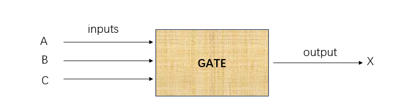
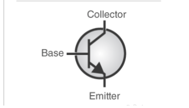
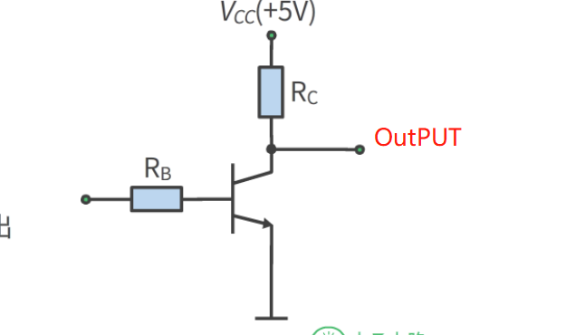
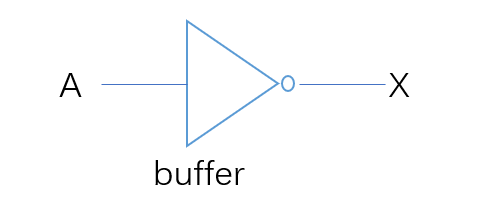
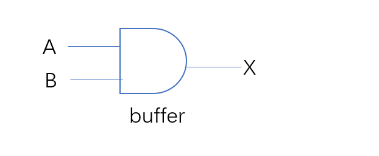
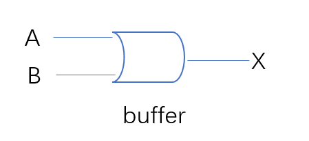
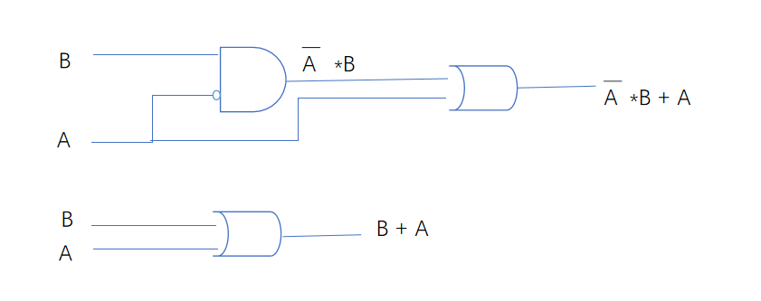
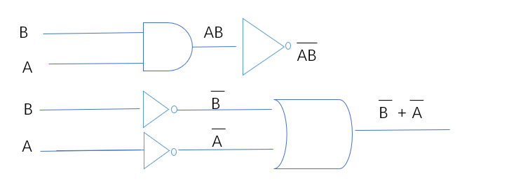
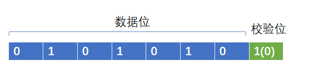

# 逻辑门和布尔代数

我大学在学习 布尔代数的时候，感觉老师就是在讲 什么AND OR,虽然学到最后，考试也都没有问题，但是还是不知道学了这玩意有什么用，如今再次学习，不得不说是恍然大悟

我先把我自己关于这块的一点点理解说一下：计算机完成计算的实现，本质上就是逻辑运算，也叫真值表排列吧，我先举一个例子，你可以屏蔽掉相关术语的使用，关于一个加法的实现： 0+0=0，1+0=1. 1+1 = 2 可以变成下面的真值表：
这里涉及到二进制、也涉及到真值表，这些概念以后你都会了解，但是如果你已经是一名程序员，我相信你也不陌生这些概念，这里最神奇的地方就在于，我们理所应当认为的数学计算，居然变成了逻辑表达式，而逻辑表达式，最后又可以变成电路图，电路图最后又可以画在电路板上,这样一个能够每秒运行1亿次的加法器就出现了

| 输入 |     | 输出 |     |
|------|-----|------|-----|
| A    | B   | 进位 | 个位 |
|------|-----|------|-----|
| 0    | 0   | 0    | 0   |
| 0    | 1   | 0    | 1   |
| 1    | 0   | 0    | 1   |
| 1    | 1   | 1    | 0   |

所以，我想说，计算机内部实际上就是由基础的门组成的复杂电路，这些电路总是能在某个条件下，完成特定的计算，所以，学习这些基础门成为了一个必要

## 基本概念

### 模拟电路
有1个以上的输入(Inputes)，经过这个小型电路后，只有1个输出(output)。

### 公式
小型电路设计隐含有一个数学公式（否则输出就是混乱的）。

### 真值表(Truth Table)
用来描述 inputs 到 output 的关系映射。
比如 假设有ABC三个输入, 输出 = X ,公式：输入有两个1，X=1,否则X=0,下面是一个例子：

| 输入 |     |      | 输出|
|------|-----|------|-----|
| A    | B   | C    | X   |
|------|-----|------|-----|
| 0    | 0   | 0    | 0   |
| 0    | 0   | 1    | 0   |
| 0    | 1   | 0    | 0   |
| 0    | 1   | 1    | 1   |
| 1    | 0   | 0    | 0   |
| 1    | 0   | 1    | 0   |
| 1    | 1   | 0    | 1   |
| 1    | 1   | 1    | 0   |

### 晶体管
在开始讲门之前，要先在讲一下晶体管，门不是凭空出现的，他最终其实还是由晶体管实现的，
可以理解为晶体管是计算里面最小的单元了，他长这样： 

通过控制Base，实现电流的通路，非常简单，就可以把他当成是开关;
开关开启;电流通，开关关闭，电流不通，对应两个状态：通 和 不通

### bit
已经知道计算机内部使用的是二进制，1 Bit 只有两个状态 0，1

关于计算机为什么使用0和1，很简单，因为电路在设计上，通过表达通不通只有两种状态，
其实可能还有其他原因，比如电压的稳定性，在这里，我们可以简单的把之前晶体管的状态用1个bit表示，
 - 通：1 
 - 不通：0 

## Inverter(Not Gate)
已经有了晶体管和bit的概念，我们继续看第一个基础logic gate： 非门

**定义** ： 输入1，输出0。输出0， 输出1。

### 如何实现
在晶体管，我们知道，输入1 输出1 输入0 输出0是很好实现的，那么怎么实现非门? 

当输入Rb = 0,下面电路不通，但是OUTPUT 会处于高电压，因此输出是1 
当输入Rb = 1,下面电路通，但是OUTPUT 会处于低电压，因此输出是0 

### 真值表

| 输入 | 输出 |
|------|------|
| A    | X    |
| 0    | 1    |
| 1    | 0    |

### 电路表达式

### 数学表达式

$$ X = \overline{A} $$

## And Gate 与门

**定义**: 输入全都是1，输出1； 如果输入有任意1个0，输出0

下面我们输入有两个假定A B，但是实际输入可以是任意多个

### 如何实现
其实可以想像程就是一个电路串联，只要有一个开关关闭，电路不通即可

### 真值表

| 输入 |   | 输出 |
|------|---|------|
|  A   | B |  X   |
|------|---|------|
|  0   | 0 |  0   |
|  0   | 1 |  0   |
|  1   | 0 |  0   |
|  1   | 1 |  1   |

### 电路表达式

### 数学表达式

$$ X = A \cdot B $$

## OR Gate

**定义**: 输入任意一个是，输出1； 如果输入全部为0，输出0

### 如何实现
其实可以想像程就是一个电路并联，只要有一个开关开启，电路就能导通

### 真值表

| 输入 |   | 输出 |
|------|---|------|
|  A   | B |   X  |
|------|---|------|
|  0   | 0 |  0   |
|  0   | 1 |  1   |
|  1   | 0 |  1   |
|  1   | 1 |  1   |

### 电路表达式

### 数学表达式

$$ X = A + B $$

## 组合门
我们已经知道基本的三个逻辑门： 非门 与门 或门， 其实还有一个异或门，我并不想把他当成基础门，因为他的实现是基于前面三个基础门实现的，不管怎么说，目前为止，我们已经可以抛弃掉晶体管这个东西了，以后我们都会使用晶体管组装程的逻辑门，晶体管到现在已经完成了他的使命，有了基础门这一层抽象，我们接下来就要尝试做更加复杂的事情了，但是别怕，最终也就像现在一样，你不会在关心基础门，而是只是使用他更高一层的抽象 

组合门可以完成的工作有很多，就比如CPU里面的加减法单元，又或者是CPU里面的逻辑单元，只要能够完成这个目标： 
定义了N个输出，并且你确定了这N个输出经过组合门以后，出来的是你的预期，OK，这个组合门就完成了他的使命，但是怎么样去实现这个目标？这就继续需要我们接下来的理论基础

## 布尔恒等式
让我们从一个例子入手，现在有一个代数式：

$$ X = A + \overline{A} \cdot B $$
   
利用我们之前所学 我们可以推导出他的电路和真值表

| 输入 |    | 输出 |             |                          |                      |               |
|------|----|------|-------------|------------------------|---------------------|---------------|
| A    | B  | $\overline{A}$ | $\overline{A} \cdot B$ | $A + \overline{A} \cdot B$ | $A + B$ |              |
| 0    | 0  | 1    | 0           | 0                      | 0                   |               |
| 0    | 1  | 1    | 1           | 1                      | 1                   |               |
| 1    | 0  | 0    | 0           | 1                      | 1                   |               |
| 1    | 1  | 0    | 0           | 1                      | 1                   |               |

请注意上面真值表，我们额外增加了一列, A+B，虽然这个代数式形式上和我们要的不一样，但是我们发现他们真值表的输出是一样的

在对比一下他们的电路结构图

无论如何，A+B在电路上会更加简洁，从电气特点上来看，就要更加节省功耗、布局更加简单，更不容易出错，既然有这么多的好处，
在结果一样的情况下， 我们当然更希望使用第二个电路,那么怎么样才能知道一个代数表达式的恒等式？ 

**定义* :
相同的输入（变量），两个布尔代数表达式，推导出的真值表结果是是一样的，这两个代数表达式是恒等式

## 基本恒等式
上一个小节，我们观察到可以通过代数恒等式简化原有复杂的逻辑，这就好比我们知道 (A+B+C+D) * 0 = 0
接下来，我们从四个维度来观察 基本逻辑门的性质

### 计算因子:A 

$$ A \cdot A  = A $$
  
$$ A + A  = A $$
 
$$ A \oplus A = 0  $$
  
**注意**: 
活学活用，在汇编中，如果希望初始化一个变量=0，使用 MOV A, #0, 这条汇编隐含有会访问两次内存，第一次从内存获取指令，第二次从内存获取常量;
利用 XOR 的特性，可以改为： XOR A, A; 所以在看到这个汇编指令，要知道这是 clear A 的快速指令

### 计算因子: A的反

$$ A \cdot \overline{A} = 0  $$

$$ A + \overline{A} = 1 $$
  
$$ A \oplus \overline{A} = 1  $$

### 计算因子:1

$$ A \cdot 1  = A $$

$$  A + 1  = 1 $$
 
$$ A \oplus 1 = \overline{A} $$

### 计算因子: 0

$$ A \cdot 0  = 0 $$

$$ A + 0  = A  $$

$$ A \oplus 0 = A $$

上述结论 都可以通过真值表推导出来，后续我们在学习按位计算 会用到这些基本恒等式

## 布尔代数式性质
本节会介绍布尔代数的 交换律、结合律、分配律；这些都可以通过真值表证明

### 交换律(Commutative Law) 

$$  A + B  = B + A $$

$$  A \cdot B  = B \cdot A $$

### 结合律(Associative Law)

$$ A + (B + C) = (A + B) + A   $$
$$ A \cdot (B \cdot C) = (A \cdot B) \cdot A  $$
  
### 分配律(Distributive Law)

$$ A \cdot (B + C) = A \cdot B + A \cdot C $$

请自行通过真值表证明 接下来我们看一个不是那么明显的恒等式

### 应用

$$ A + B \cdot C = (A + B) \cdot (A + C) $$

证明此恒等式 需要用到基本恒等式 和 交换律 结合律 分配律

### 德摩根定律

Not Gate并不适用布尔代数式的特性(分配律、交换律、结合律)

$$ \overline{A \cdot B} !=  \overline{A} \cdot \overline{B} $$
  
|  输入|     | 输出 |               |          |          |               |               |
|-----|------|------|---------------|----------|----------|---------------|---------------|
|A    |  B   |  A*B |  Inverse(A*B) |Inverse(A)|Inverse(B)| IN(A)*IN(B)   |IN(A)+IN(B)    |
|0    |  0   |   0  |  1            |   1      |    1     |       1       |       1       |
|0    |  1   |   0  |  1            |   1      |    0     |       0       |       1       |
|1    |  0   |   0  |  1            |   0      |    1     |       0       |       1       |
|1    |  1   |   1  |  0            |   0      |    0     |       0       |       0       |

但是下述恒等式成立

$$  \overline{A \cdot B} =  \overline{A} + \overline{B} $$
  

  
同理可证得 

$$ \overline{A+B} = \overline{A} \cdot \overline{B} $$

### 练习
我们已经学习了布尔代数的基本表达式，让我们通过几个练习，看看在简化逻辑上能帮助我们多少

#### 练习1

 $$ A + A \cdot B  = A \cdot 1 + A \cdot B  = A (1 + B) = A $$

#### 练习2

$$
  A + \overline{A} \cdot B  = (A + \overline{A}) \cdot (A + B) = 1 \cdot (A + B) = A + B
$$

#### 练习3
$$ 

  \overline{A+B+C} \cdot B =  (\overline{A} \cdot \overline{B} \cdot \overline{C}) \cdot B
   = \overline{A} \cdot \overline{C} \cdot (\overline{B} \cdot B)
   = (\overline{A} \cdot \overline{C}) \cdot 0
   = 0
$$

### 练习4

$$
   (A+B) \cdot (B + \overline{A} ) = A \cdot B + A \cdot \overline{A} + B \cdot B + B \cdot  \overline{A} 
    = A \cdot B + 0 + B + B  \cdot  \overline{A}
    = B \cdot (A + 1 + \overline{A})	 
	= B \cdot (1 + A + \overline{A}) = B \cdot 1 = B
$$

### 练习5

$$
   A \cdot B \cdot \overline{C}  + B \cdot \overline{C} \cdot D +  \overline{A + \overline{B} + C} 
   =  A \cdot B \cdot \overline{C}  + B \cdot \overline{C} \cdot D + \overline{A} \cdot B \cdot \overline{C}
   = B \cdot \overline{C} \cdot (A + D + \overline{A}) 
   = B \cdot \overline{C} \cdot (A+\overline{A} + D) 
   = B \cdot \overline{C} \cdot (1 + D)  
   = B \cdot \overline{C}
$$ 

## SOP(Sum Of Product)
经过之前学习，我们对电路、真值表、代数表达式、代数表达式简化这些概念已经有了很清晰的认识
OK，我们也可以从一个代数表达式推导出 真值表和电路图，那么有没有可能从任意的真值表 推导出代数表达式？
事实上 我真的很喜欢这章，这节内容把数学的美又一次完美呈现了出来 

假定我们有A B C 三个输入，我给出的逻辑语义是：如果正好有两个相邻的输入相等，输出1,让我们看一下他的真值表

| 输入|    |     |输出 |
| --- |--- | --- |--- |
| A   | B  | C   | X |
| --- |--- | --- | --- |
| 0 | 0 | 0 | 0 |
| 0 | 0 | 1 | 1 |
| 0 | 1 | 0 | 0 |
| 0 | 1 | 1 | 1 |
| 1 | 0 | 0 | 1 |
| 1 | 0 | 1 | 0 |
| 1 | 1 | 0 | 1 |
| 1 | 1 | 1 | 0 |

请问 是否能够从上述真值表直接推导出 布尔表达式？反正我第一眼傻了，让我们看看通过下面的学习能不能解决这个问题？

我们已经知道 AND GATE， 只有当所有输入都为1，输出为1, 如果我把这个唯一的一任意在输出行上下移动呢？我只需要把那行的输入 如果是0 进行反转即可
比如如果第一行是1，则三个都取反，第二行1,前两个取反，以此类推

|  输入|     |      | 输出  |                                  |
|-----|------|------|-------|----------------------------------|
|A    |  B   |  C   |  A*B*C|  Inverse(A)*Inverse(B)*Inverse(C)|
|  0  |  0   |  0   |   0   |  1    |
|  0  |  0   |  1   |   0   |  0    |
|  0  |  1   |  0   |   0   |  0    |
|  0  |  1   |  1   |   0   |  0    |
|  1  |  0   |  0   |   0   |  0    |
|  1  |  0   |  1   |   0   |  0    |
|  1  |  1   |  0   |   0   |  0    |
|  1  |  1   |  1   |   0   |  0    |

目前，我们知道，通过AND GATE，我们可以得到一个只有一行输出是1的真值表，回到我们一开始的真值表，如果多个1怎么办呢？
通过下面的真值表 我相信你已经猜出来了，我们可以把真值表的1，拆成N(1的数量)个输出的 OR GATE，那么就会得到

|  输入|     |      | 输出  |       |       |       |       |
|-----|------|------|-------|-------|-------|-------|-------|
|A    |  B   |  C   |  X    | X0    | X1    | X2    |  X3   |
|  0  |  0   |  0   |   0   | 0     | 0     | 0     | 0     |
|  0  |  0   |  1   |   1   | 1     | 0     | 0     |  0    |
|  0  |  1   |  0   |   0   | 0     | 0     | 0     | 0     |
|  0  |  1   |  1   |   1   | 0     | 1     | 0     |  0    |
|  1  |  0   |  0   |   1   | 0     | 0     | 1     | 0     |
|  1  |  0   |  1   |   0   | 0     | 0     | 0     | 0     |
|  1  |  1   |  0   |   1   | 0     | 0     | 0     |  1    |
|  1  |  1   |  1   |   0   | 0     | 0     | 0     | 0     |

$$

   X = X0 + X1 + X2 + X3 =  \overline{A} \cdot \overline{B}  \cdot C  +  \overline{A} \cdot B  \cdot C  +  
       A \cdot \overline{B}  \cdot \overline{C}  + A \cdot B  \cdot \overline{C}
	 =  (\overline{B} +  \cdot B) \overline{A} \cdot C +   A \cdot \overline{C} ( \overline{B} + B )
	 = 1 \cdot  \overline{A} \cdot C +  A \cdot \overline{C}   \cdot 1 
	 = \overline{A} \cdot C  + A \cdot \overline{C}
$$

## 异或门

XOR 全拼是 EXCLUSIVE OR GATE 

**定义**：  输入是奇数个1，输出1， 输入是偶数个1，输出0

一般习惯把异或门也作为基础门电路，但是实际上，异或门的电路设计其实还是通过三种基础门构成的，只是他确实也经常使用

### 奇偶校验
奇偶校验是XOR GATE的一个现实应用，在数据传输过程中，可能会有1bit数据丢失，通过额外扩展1bit实现下面功能
 
 - 偶校验: 数据位+扩展位 总是会保证1的个数是偶数个 如果数据位有奇数个1 则扩展位补1 否则补0(什么都不做)
 - 奇校验: 数据位+扩展位 总是会保证1的个数是奇数个 如果数据位有奇数个1 则扩展位补0(什么都不做) 否则补1

无论是哪种校验，都是通过1的数量的奇偶来判断的, 接收端怎么样解决丢失的1bit数据的恢复呢? 
假如丢失了1bit数据，在偶校验条件下，则数据位(除去丢失的1bit)+扩展位 所有bit xor值应该是0,如果不是0,则丢失的1bit是1，否则是0

### 电路实现设计
我们已知真值表如下：

|输入 |      | 输出 |
|-----|------|------|
|A    |  B   |  X   |
+-----+------+------+
|  0  |  0   |  0   |
+-----+------+------+
|  0  |  1   |  1   |
+-----+------+------+
|  1  |  0   |  1   |
+-----+------+------+
|  1  |  1   |  0   |
+-----+------+------+

利用上一个章节的 SOP 方法，可以把真值表拆解为

|  输入|      | 输出 |      |
|-----|------|------|-----|
|A    |  B   |  X0  | X1  |
|  0  |  0   |  0   |  0  |
|  0  |  1   |  1   |  0  |
|  1  |  0   |  0   |  1  |
|  1  |  1   |  0   |  0  |

数学表达式推导为：
$$ X = X0 + X1 = \overline{A} \cdot B + A \cdot \overline{B}  $$

## 抽象的建立
通过本节的学习，我们需要完成从半导体晶体管 到 逻辑门抽象的建立，以后我们只需要认为逻辑门是不同晶体管组合构成的电路即可，好比是魔方， 
半导体晶体管是最基础的颗粒，我们通过这些颗粒组成了一些基本形状(长方形、方形、三角形)，后续，我们只需要使用这些固定形状的积木去搭建房子，而不需要在关注最小的颗粒，这就完成了抽象的建立

## 逻辑门的应用
之前章节，我们从数学理论、布尔代数、以及一些公式、到真值表把逻辑的基础原理描述清楚，但是，有了这些基础原理，又应该如何应用到我们的现实世界呢？

### ALU

计算机的世界，本质上就是在处理逻辑，通过不同逻辑的组成，具备复杂的功能 
这是一个CPU 现实应用，假如我们现在要对两个8bit字节相加 让我们看看如何用逻辑门实现，由于已经有非常好的示例，参考下面视频讲解即可
https://thecrashcourse.com/courses/how-computers-calculate-the-alu-crash-course-computer-science-5/

经过逻辑门的组成，我们让电子电路具备了数学运算的能力

### 锁存的实现

参考下面讲解
https://thecrashcourse.com/courses/registers-and-ram-crash-course-computer-science-6/

经过逻辑门的组成，我们让电子电路具备了存储数据的能力

### 其他应用
其实电子电路经过设计，通过逻辑门的组成，总能实现一个固定的作用，但是我们也不会把任何功能都设计通过硬件完成，这样的电路不够灵活，成本也高，通过把一些固定的功能(比如ALU计算单元)通过硬件电路固化下来，然后在利用编程语言组织利用这些组装好的电子电路，就可以实现更加复杂的功能，这里有一个不太恰当的比喻:通过利用加法的实现，我们可以实现乘法计算，把 a * 100 换算成 a 连续增加100次即可，事实上，在很早的计算机，甚至现在比较低级的计算单元，可能依然是这么使用的

## 总结
真值表、布尔代数、逻辑门是构成半导体电路设计的基石,这部分内容不要求完全掌握，但是要知道原理，能够帮助我们更好的理解CPU的设计实现

