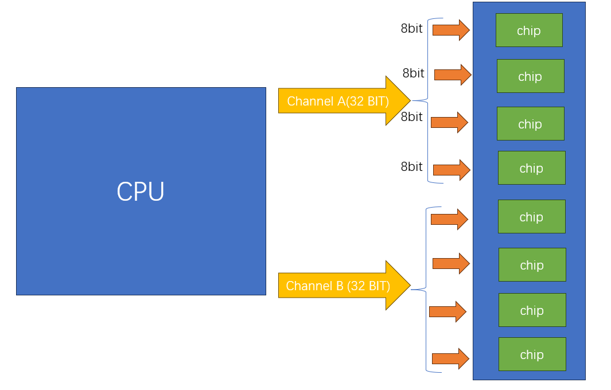

# 内存

## 参考
 
 - https://www.youtube.com/watch?v=7J7X7aZvMXQ&t=527s 
 - https://thecrashcourse.com/courses/registers-and-ram-crash-course-computer-science-6/

上图展示了内存数据通道，这里展示的一个内存条 一共有 8个 芯片，这8个芯片并行工作

 - 21位的地址总线
 - 7位的控制总线
 - 一个chip里面有8个bank group， 每个bank group 有4个bank 也就是一个chip有32个bank，以我们这里的16G内存条，每个chip容量就是2GB，32个bank，每个bank就是64MB
 - 每个bank有8192列 65536行，65536 * 8192 / 8/1024  =  65536 KB = 64MB
 - 一个chip内部寻址 需要31位地址总线，3bit选择group， 2bit选择bank，16bit选择行，10bit选择列
 - 10bit = 1024，可以选择 8192 列，因为我们默认芯片是按照8bit寻址的，也就是一个地址可以传输8bit，下一个地址就是下一个8bit
 - 寻址需要31bit，但是只有21位地址总线，地址分两次传输，前21位(3+2+16) 作为行地址 后十位列地址第二次传送

我们需要知道: 

 - 内存的cell 是利用了锁存的技术实现了存储
 - 内存每次加载和存储，都需要经过CPU 的寄存器，CPU 的寄存器和内存直连
 - 内存地址编码 是32位或者64位对齐的

